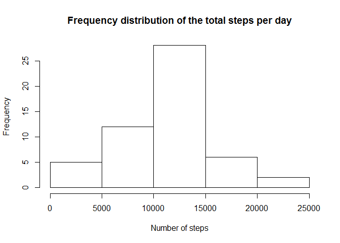
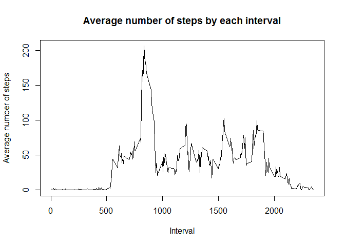
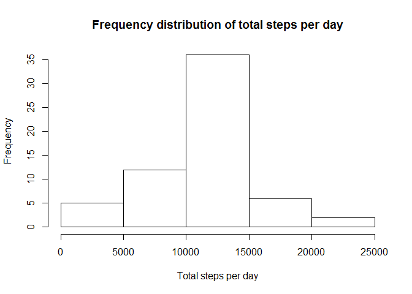
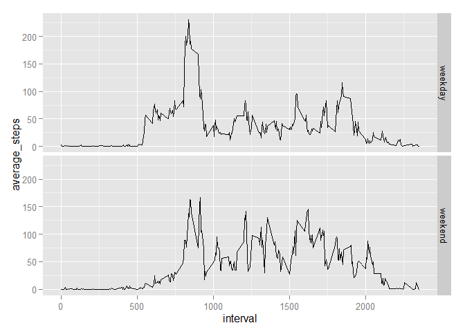

# Reproducible Research: Peer Assessment 1


```r
library(dplyr)
library(ggplot2)
```

## Loading and preprocessing the data

####1. Load the data

```r
if (!file.exists('./activity.csv')) {
  unzip('activity.zip', unzip = "unzip")
}
dataset_original <- tbl_df(read.csv('activity.csv'))
```

####2. Process/transform data

```r
dataset_original <- transform(dataset_original, date = as.Date(date, "%Y-%m-%d"))
summary(dataset_original)
```

```
##      steps             date               interval     
##  Min.   :  0.00   Min.   :2012-10-01   Min.   :   0.0  
##  1st Qu.:  0.00   1st Qu.:2012-10-16   1st Qu.: 588.8  
##  Median :  0.00   Median :2012-10-31   Median :1177.5  
##  Mean   : 37.38   Mean   :2012-10-31   Mean   :1177.5  
##  3rd Qu.: 12.00   3rd Qu.:2012-11-15   3rd Qu.:1766.2  
##  Max.   :806.00   Max.   :2012-11-30   Max.   :2355.0  
##  NA's   :2304
```


## What is mean total number of steps taken per day?

####1. Calculate the total number of steps taken per day

```r
total_per_day <- group_by(dataset_original, date)%>%summarize(total_steps = sum(steps)); print(total_per_day, n = 61)
```

```
## Source: local data frame [61 x 2]
## 
##          date total_steps
## 1  2012-10-01          NA
## 2  2012-10-02         126
## 3  2012-10-03       11352
## 4  2012-10-04       12116
## 5  2012-10-05       13294
## 6  2012-10-06       15420
## 7  2012-10-07       11015
## 8  2012-10-08          NA
## 9  2012-10-09       12811
## 10 2012-10-10        9900
## 11 2012-10-11       10304
## 12 2012-10-12       17382
## 13 2012-10-13       12426
## 14 2012-10-14       15098
## 15 2012-10-15       10139
## 16 2012-10-16       15084
## 17 2012-10-17       13452
## 18 2012-10-18       10056
## 19 2012-10-19       11829
## 20 2012-10-20       10395
## 21 2012-10-21        8821
## 22 2012-10-22       13460
## 23 2012-10-23        8918
## 24 2012-10-24        8355
## 25 2012-10-25        2492
## 26 2012-10-26        6778
## 27 2012-10-27       10119
## 28 2012-10-28       11458
## 29 2012-10-29        5018
## 30 2012-10-30        9819
## 31 2012-10-31       15414
## 32 2012-11-01          NA
## 33 2012-11-02       10600
## 34 2012-11-03       10571
## 35 2012-11-04          NA
## 36 2012-11-05       10439
## 37 2012-11-06        8334
## 38 2012-11-07       12883
## 39 2012-11-08        3219
## 40 2012-11-09          NA
## 41 2012-11-10          NA
## 42 2012-11-11       12608
## 43 2012-11-12       10765
## 44 2012-11-13        7336
## 45 2012-11-14          NA
## 46 2012-11-15          41
## 47 2012-11-16        5441
## 48 2012-11-17       14339
## 49 2012-11-18       15110
## 50 2012-11-19        8841
## 51 2012-11-20        4472
## 52 2012-11-21       12787
## 53 2012-11-22       20427
## 54 2012-11-23       21194
## 55 2012-11-24       14478
## 56 2012-11-25       11834
## 57 2012-11-26       11162
## 58 2012-11-27       13646
## 59 2012-11-28       10183
## 60 2012-11-29        7047
## 61 2012-11-30          NA
```

####2. Make a histogram of the total number of steps taken each day


```r
hist(total_per_day$total_steps, main = "Frequency distribution of the total steps per day", xlab = "Number of steps")
```

 

####3. Calculate and report the mean and median of the total number of steps taken per day

```r
mean(total_per_day$total_steps, na.rm = T)
```

```
## [1] 10766.19
```

```r
median(total_per_day$total_steps, na.rm = T)
```

```
## [1] 10765
```


## What is the average daily activity pattern?

####1. Make a time series plot (i.e. type = "l") of the 5-minute interval (x-axis) and the average number of steps taken, averaged across all days (y-axis)

```r
average_per_interval <- group_by(dataset_original, interval)%>%summarize(average_steps = mean(steps, na.rm = T))
plot(average_per_interval$average_steps ~ average_per_interval$interval, type = "l", main = "Average number of steps by interval", xlab = "Interval", ylab = "Average number of steps")
```

 

####2. Which 5-minute interval, on average across all the days in the dataset, contains the maximum number of steps?

```r
filter(average_per_interval, average_steps == max(average_steps))
```

```
## Source: local data frame [1 x 2]
## 
##   interval average_steps
## 1      835      206.1698
```

## Imputing missing values

####1. Calculate and report the total number of missing values in the dataset (i.e. the total number of rows with NAs)

```r
sapply(dataset_original, function(x) length(which(is.na(x))))
```

```
##    steps     date interval 
##     2304        0        0
```
The number of rows with missing values is 2304. The missing values only occur in the 'steps' column.

####2./3. Devise a strategy for filling in all of the missing values in the dataset. Create a new dataset that is equal to the original dataset but with the missing data filled in.

```r
### This replaces all NA's with the average number of steps in the corresponding interval, averaged accross all days:

dataset_2 <- dataset_original[,] 

for (index in seq_along(dataset_2$steps)) {

  if (is.na(dataset_2$steps[index])) {
    dataset_2$steps[index] <- mean(dataset_2$steps[dataset_2$interval==dataset_2$interval[index]], na.rm = T)
  }
}
```

####4. Make a histogram of the total number of steps taken each day and Calculate and report the mean and median total number of steps taken per day. Do these values differ from the estimates from the first part of the assignment? What is the impact of imputing missing data on the estimates of the total daily number of steps?

```r
total_per_day <- group_by(dataset_2, date)%>%summarize(total_steps = sum(steps))

hist(total_per_day$total_steps, main = "Frequency distribution of total steps per day", xlab = "Total steps per day")
```

 

```r
mean(total_per_day$total_steps)
```

```
## [1] 10766.19
```

```r
median(total_per_day$total_steps)
```

```
## [1] 10766.19
```

## Are there differences in activity patterns between weekdays and weekends?

####1. Create a new factor variable in the dataset with two levels - "weekday" and "weekend" indicating whether a given date is a weekday or weekend day.

```r
dataset_2$part_of_week[weekdays(dataset_2$date)%in% c("Monday", "Tuesday", "Wednesday", "Thursday", "Friday")] = 'weekday'
dataset_2$part_of_week[weekdays(dataset_2$date)%in% c("Saturday", "Sunday")] = 'weekend'
```

####2. Make a panel plot containing a time series plot (i.e. type = "l") of the 5-minute interval (x-axis) and the average number of steps taken, averaged across all weekday days or weekend days (y-axis)

```r
average_per_interval_poweek <- group_by(dataset_2, interval, part_of_week)%>%summarize(average_steps = mean(steps))

g <- ggplot(average_per_interval_poweek, aes(interval, average_steps))
g + geom_line() + facet_grid(part_of_week~.)
```

 
